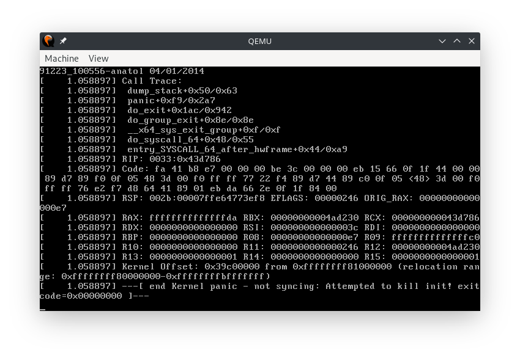

# Lab1

## Linux kernel

Download Linux 5.4.22 src from [The Linux Kernel Archives][linux-src].

Extract the `.tar.xz` file:

```bash
tar xf linux-5.4.22.tar.xz
```

Get into the src folder and compile the kernel.

```bash
cd linux-5.4.22
make defconfig  # Use default config according to current OS and hardware environment.
make xconfig  # As I am using KDE, use QT-based GUI config windows.
# Remove some unused functions, such as network, sound and virtualization.
make -j6  # I am usng i5-8250U, which is a 4C8T low-voltage CPU.
# Then we can found the `bzImage` file in `arch/x86/boot`, which is 2113 kB large.
```

## initrd and init

### Simple initrd

Create `init.c` with respective code.

Compile and staticly link it with `gcc`.

Create the gzip initrd with `cpio` and `gzip`.

Boot the kernel with the initrd with:

```bash
qemu-system-x86_64 -kernel bzImage -initrd initrd.cpio.gz
```

We will see:



Which has no "Hello, Linux!".

But this is because we try to kill the init process, which caused kernel panic.
The error info full the VGA memory-mapped screen so we can not see the required output.
Later in initrd2 we will see it.

### initrd with three programs

Create the new `init.c` to use `fork`, `execl`, `waitpid` to run given programs.

Add an endless loop in the tail to prevent the exiting of init process.

create the device files.

As I am using Manjaro, which is a kind of Linux distro, I just use `mknod` to create them.

```bash
sudo mknod dev/ttyS0 c 4 64
sudo mknod dev/fb0 c 29 0
```

Then create initrd like above.

The boot and execution is successful.

## x86 bare metal MBR program

Like ordinary programing, write source, compile it and run it.

In the source, the start part is options, then code, finally data.

As nasm does not support `dup`, I use `times` to build the constants

To wrap lines, use 13 ('\r') carriage return and 10 ('\n') line break.

Print the line text every 18 updates which is similar to 18.2.

## Questions

[linux-src]: https://www.kernel.org/
